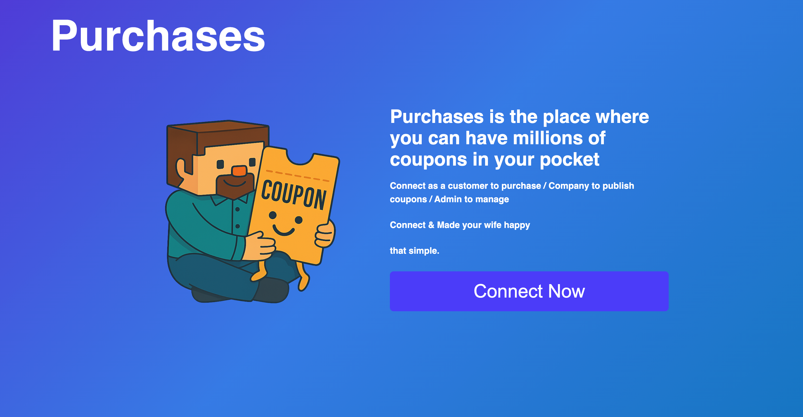
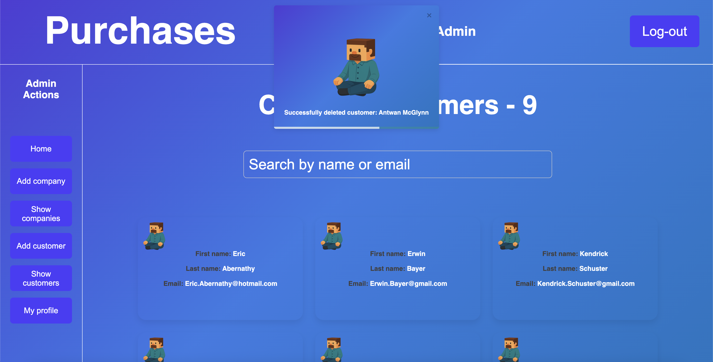
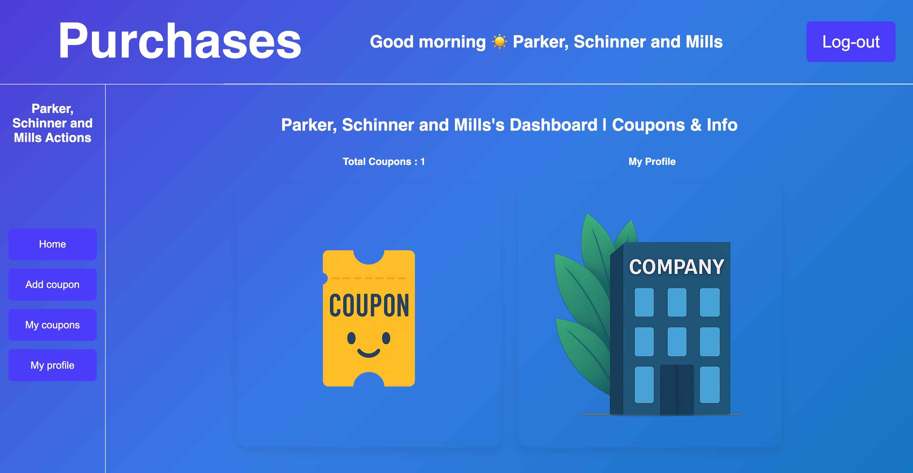
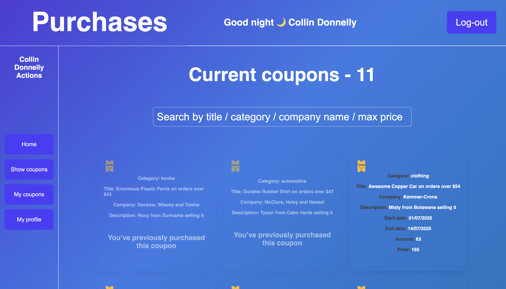
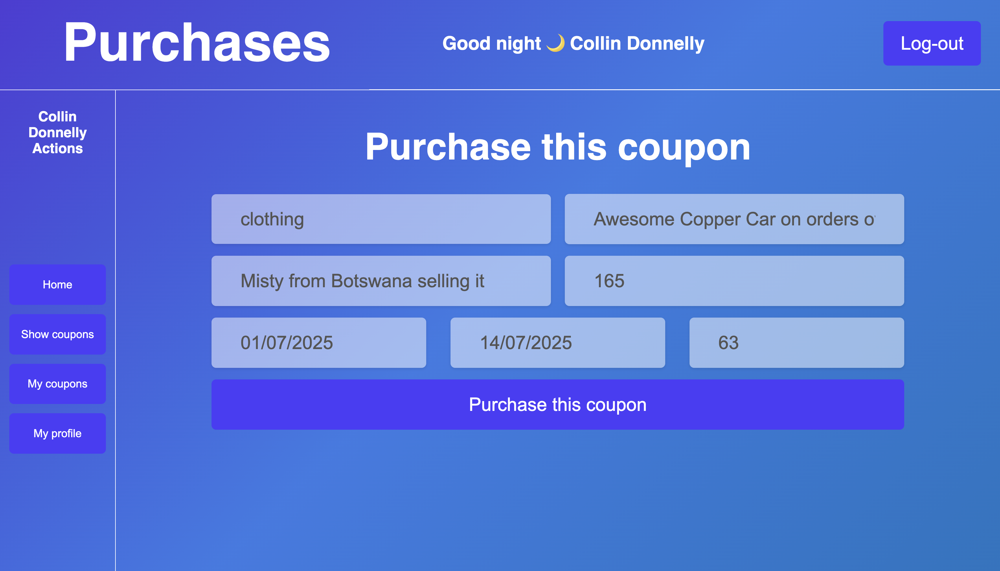

# Full-Stack Coupon System - Java + React

This is a complete coupon management system built with **Spring Boot (Java)** for the backend and **React + TypeScript** for the frontend. 
It supports multiple client types: Admin, Company, and Customer — each with dedicated features and access levels.

---

## 📦 Features

### 🔐 Authentication & Roles
- Admin, Company, and Customer login
- Token-based authentication
- Role-based access control

### 🎫 Coupons Management
- Admin: Manage all users, categories, and system-wide coupons
- Company: Create, update, and delete coupons
- Customer: View, filter, and purchase coupons

---

## 🛠️ Technologies Used

### 🧩 Backend (Spring Boot)
- Java 17
- Spring Boot
- Maven
- Hibernate + JPA
- MySQL
- Lombok

### 🖥️ Frontend (React)
- React + TypeScript
- Vite (build tool)
- Axios
- React Router DOM
- Form validation
  
---

## 🧪 Screenshots

### 🔒 Login Page

### Admin Page

### 🏢 Company Dashboard

### Customer view coupons

### Customer purchase coupon

Built by Shlomi Aflalo — shlomiaflalo.com
